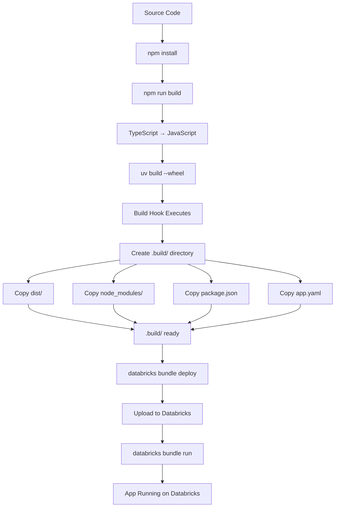

# Databricks Apps Conversion Summary

## Overview

This document summarizes the conversion of the Gmail MCP Server to support deployment on Databricks Apps, following the structure from the `custom_mcp_server_databricks` template.

## Template Compliance

### ✅ Required Files (from template)

| File | Status | Purpose |
|------|--------|---------|
| `databricks.yml` | ✅ Created | Bundle configuration for Databricks deployment |
| `app.yaml` | ✅ Created | App runtime configuration |
| `pyproject.toml` | ✅ Created | Python packaging configuration |
| `hooks/apps_build.py` | ✅ Created | Build hook for creating `.build/` directory |
| `src_python/.../static/index.html` | ✅ Created | Landing page for deployed app |

### ✅ Implementation Approach

Following the problem statement: *"You dont need to use python implementation, as long as it has the structure that databricks needs"*

We created a **hybrid approach**:
- **Structure**: Python packaging (pyproject.toml, hooks) for Databricks compatibility
- **Implementation**: Kept the original TypeScript/Node.js Gmail MCP server
- **Transport**: Added HTTP/SSE support via `src/http-server.ts`
- **Runtime**: Node.js runs directly on Databricks Apps via `app.yaml` command

## Key Changes Made

### 1. Databricks Configuration Files

#### `databricks.yml`
```yaml
bundle:
  name: gmail-mcp-server
  
resources:
  apps:
    gmail-mcp-server:
      name: "gmail-mcp-server-bundle"
      source_code_path: ./.build
```

#### `app.yaml`
```yaml
command: ["node", "dist/http-server.js"]
env:
  - name: PORT
    value: "8000"
  - name: GMAIL_CREDENTIALS_PATH
    value: /dbfs/gmail-mcp/credentials.json
```

#### `pyproject.toml`
- Defines package metadata
- Minimal Python dependencies (FastAPI, MCP, uvicorn)
- Configures build hook

### 2. Build System

#### `hooks/apps_build.py`
Custom build hook that:
- Creates `.build/` directory
- Copies compiled TypeScript (`dist/`)
- Copies Node.js dependencies (`node_modules/`)
- Copies `package.json`
- Copies `app.yaml`
- Creates `requirements.txt`

### 3. HTTP/SSE Transport

#### `src/http-server.ts`
New entry point that provides:
- Express.js web server
- SSE (Server-Sent Events) endpoint for MCP
- Landing page serving
- Health check endpoint
- Session management

**Key endpoints:**
- `/` - Landing page
- `/mcp/sse` - MCP SSE connection
- `/mcp/messages` - POST endpoint for messages
- `/health` - Health check

### 4. Static Assets

#### `src_python/gmail_mcp_server/static/index.html`
Professional landing page featuring:
- Databricks + MCP + Gmail branding
- Connection instructions
- Code examples
- Feature highlights
- Links to documentation

### 5. Documentation

Created comprehensive deployment documentation:
- `DATABRICKS_DEPLOYMENT.md` - Full deployment guide
- `QUICKSTART_DATABRICKS.md` - Quick reference
- Updated main `README.md` - Added Databricks section

### 6. Deployment Tools

#### `deploy-databricks.sh`
Automated deployment script that:
- Checks prerequisites
- Installs dependencies
- Builds TypeScript
- Creates wheel
- Deploys to Databricks
- Starts the app

## Architecture

```
┌─────────────────────────────────────────┐
│   Databricks Apps Environment           │
│                                         │
│  ┌───────────────────────────────────┐  │
│  │  Node.js Process                  │  │
│  │  (dist/http-server.js)            │  │
│  │                                    │  │
│  │  ┌─────────────────────────────┐  │  │
│  │  │  Express.js                 │  │  │
│  │  │  HTTP Server                │  │  │
│  │  └──────┬──────────────────────┘  │  │
│  │         │                          │  │
│  │  ┌──────▼──────────────────────┐  │  │
│  │  │  SSE Transport              │  │  │
│  │  │  /mcp/sse endpoint          │  │  │
│  │  └──────┬──────────────────────┘  │  │
│  │         │                          │  │
│  │  ┌──────▼──────────────────────┐  │  │
│  │  │  MCP Server                 │  │  │
│  │  │  (Gmail Tools)              │  │  │
│  │  │  • send_email               │  │  │
│  │  │  • read_email               │  │  │
│  │  │  • create_label             │  │  │
│  │  │  • create_filter            │  │  │
│  │  │  • ... (18 total tools)     │  │  │
│  │  └──────┬──────────────────────┘  │  │
│  │         │                          │  │
│  │  ┌──────▼──────────────────────┐  │  │
│  │  │  Gmail API                  │  │  │
│  │  │  (via OAuth2)               │  │  │
│  │  └─────────────────────────────┘  │  │
│  └───────────────────────────────────┘  │
│                                         │
│  Packaged by Python build tools         │
│  Running Node.js runtime                │
└─────────────────────────────────────────┘
```

## Deployment Flow



## File Structure

```
Gmail-MCP-Server/
├── databricks.yml              ← NEW: Bundle config
├── app.yaml                    ← NEW: Runtime config
├── pyproject.toml              ← NEW: Python packaging
├── deploy-databricks.sh        ← NEW: Deployment script
├── DATABRICKS_DEPLOYMENT.md    ← NEW: Full deployment guide
├── QUICKSTART_DATABRICKS.md    ← NEW: Quick reference
├── hooks/
│   └── apps_build.py           ← NEW: Build hook
├── src/
│   ├── index.ts                (Existing: stdio transport)
│   ├── http-server.ts          ← NEW: HTTP/SSE transport
│   ├── label-manager.ts        (Existing)
│   ├── filter-manager.ts       (Existing)
│   └── utl.ts                  (Existing)
├── src_python/                 ← NEW: Python wrapper
│   └── gmail_mcp_server/
│       ├── static/
│       │   └── index.html      ← NEW: Landing page
│       ├── __init__.py
│       ├── app.py
│       └── main.py
├── dist/                       (Generated: compiled TS)
├── .build/                     (Generated: deployment pkg)
├── package.json                (Updated: +express)
├── README.md                   (Updated: +Databricks section)
└── .npmignore                  (Updated: exclude Databricks files)
```

## Dependencies Added

### Node.js (package.json)
- `express`: HTTP server framework
- `@types/express`: TypeScript definitions
- `@modelcontextprotocol/sdk`: Updated to latest (1.20.2+)

### Python (pyproject.toml)
- `fastapi>=0.115.12`: Web framework (for build tooling)
- `mcp[cli]>=1.10.0`: MCP Python SDK (for build tooling)
- `uvicorn>=0.34.2`: ASGI server (for build tooling)
- `hatchling>=1.27.0`: Build backend

## Testing Checklist

### Local Testing
- [ ] `npm install` works
- [ ] `npm run build` compiles successfully
- [ ] `node dist/http-server.js` starts server locally
- [ ] Can access `http://localhost:8000/`
- [ ] Can access `http://localhost:8000/health`

### Build Testing
- [ ] `uv sync` installs Python dependencies
- [ ] `uv build --wheel` creates wheel successfully
- [ ] `.build/` directory created with correct contents:
  - [ ] `dist/` directory
  - [ ] `node_modules/` directory
  - [ ] `package.json`
  - [ ] `app.yaml`
  - [ ] `*.whl` file
  - [ ] `requirements.txt`

### Deployment Testing (Requires Databricks)
- [ ] `databricks auth login` succeeds
- [ ] `databricks bundle deploy` uploads successfully
- [ ] `databricks bundle run` starts app
- [ ] App accessible via Databricks URL
- [ ] `/mcp/sse` endpoint responds
- [ ] Can connect MCP client and list tools
- [ ] Gmail tools function correctly

## Comparison with Template

| Aspect | Template (Python) | Our Implementation (Hybrid) |
|--------|------------------|----------------------------|
| **Language** | Python | TypeScript/Node.js |
| **MCP Library** | FastMCP (Python) | @modelcontextprotocol/sdk (TS) |
| **Web Framework** | FastAPI | Express.js |
| **Transport** | StreamableHTTP | SSE (Server-Sent Events) |
| **Build System** | Python (uv/hatch) | Python (uv/hatch) + npm |
| **Runtime** | Python | Node.js |
| **Structure** | ✅ Identical | ✅ Identical |

## Benefits of This Approach

1. **Preserves Existing Implementation**: All Gmail functionality remains in TypeScript
2. **Minimal Changes**: Only added HTTP transport, no rewrites
3. **Databricks Compatible**: Follows template structure exactly
4. **Flexible**: Can still run locally with stdio transport
5. **Maintainable**: Separate concerns (stdio vs HTTP transport)

## Known Limitations

1. **Node.js Dependency**: Databricks Apps must support Node.js runtime
2. **Large Package**: `node_modules/` can be large (mitigated by `.npmignore`)
3. **Dual Build System**: Requires both npm and uv for development

## Future Enhancements

- [ ] Add comprehensive tests for HTTP server
- [ ] Optimize package size (tree-shaking, production build)
- [ ] Add monitoring/observability
- [ ] Support WebSocket transport (in addition to SSE)
- [ ] Add rate limiting
- [ ] Add request logging

## References

- Template: https://github.com/murtihash94/custom_mcp_server_databricks
- MCP Specification: https://modelcontextprotocol.io/
- Databricks Apps: https://docs.databricks.com/apps/
- Express.js: https://expressjs.com/

## Support

For questions or issues:
1. Check `DATABRICKS_DEPLOYMENT.md` for deployment help
2. Check `QUICKSTART_DATABRICKS.md` for quick reference
3. Open an issue on GitHub
4. Consult Databricks documentation for platform-specific issues
